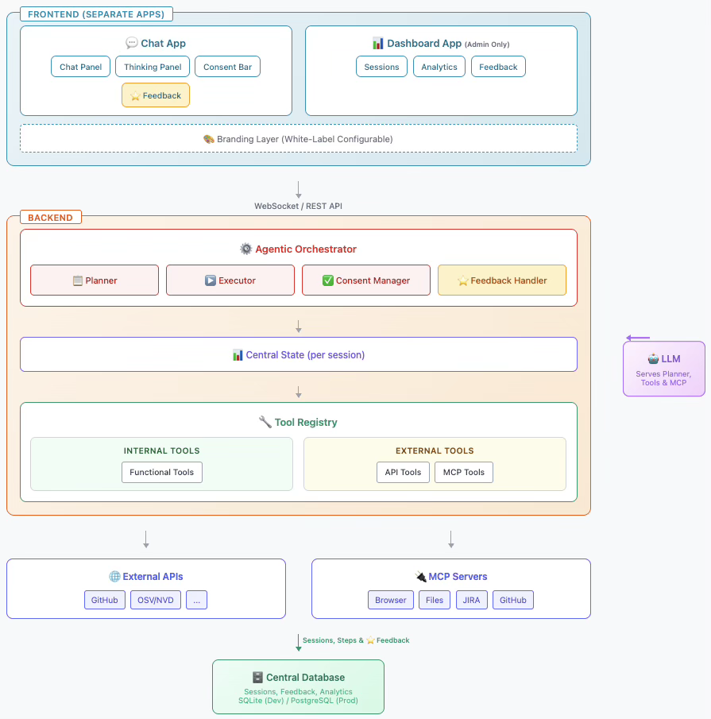

# OCP Sustaining Agentic Bot
## Architecture & Design Document

---

## 1. Executive Summary

The **OCP Sustaining Agentic Bot** is an extensible, AI-powered assistant designed for CVE analysis and remediation workflows. Built with a modular architecture, it enables easy onboarding of new tools/features while providing a transparent, consent-driven user experience.

### Key Differentiators
- **Transparent AI Reasoning**: Collapsible thinking/planning panel (similar to Cursor, Claude)
- **Consent-First Execution**: User approval required before tool execution
- **White-Label Ready**: Configurable branding for multi-team adoption
- **Extensible Tool System**: Add new capabilities via simple tool registration

---

## 2. High-Level Architecture



*High-level architecture showing separate Frontend applications (Chat App, Dashboard App), shared Backend (Orchestrator, State, Tools), External Services, and Central Database*

---

## 3. Core Components - Design

### 3.1 Agentic Orchestrator

The brain of the system that coordinates planning, execution, and user consent.

#### 3.1.1 Planner Module

**Purpose**: Analyzes user intent and creates an execution plan using available tools.

**Responsibilities**:
- Parse and understand natural language prompts via LLM
- Query Tool Registry for available capabilities
- Generate step-by-step action plan with tool invocations
- Handle "capability not available" scenarios gracefully
- Stream thinking/reasoning process to frontend

**Input/Output Flow**:
```
User Prompt → Intent Analysis → Tool Matching → Plan Generation → Execution Plan
```

**Plan Structure**:
```
Plan {
    plan_id: string
    user_prompt: string
    thinking_process: string[]          // Reasoning steps (displayed in collapsible panel)
    steps: PlanStep[]
    estimated_duration: string
    requires_consent: boolean
    created_at: timestamp
}

PlanStep {
    step_id: string
    order: number
    tool_name: string
    tool_description: string
    parameters: dict
    expected_output: string
    risk_level: "low" | "medium" | "high"
    requires_individual_consent: boolean
    dependencies: string[]              // step_ids this depends on
    status: "pending" | "approved" | "rejected" | "executing" | "completed" | "failed"
}
```

#### 3.1.2 Executor Module

**Purpose**: Executes approved plan steps by invoking tools while maintaining awareness of Central State.

**Responsibilities**:
- Read from Central State to check preconditions
- Invoke tools with state-derived parameters
- Allow tools to write their outputs to state
- **Executor also writes** execution metadata (step status, retry count, errors)
- Handle consent flow when tool requires it
- Make retry/skip/abort decisions based on state

**State Write Permissions**:
| Writer | What It Writes |
|--------|----------------|
| **Tool** | Domain outputs (cve_details, affected_packages, test_results, etc.) |
| **Executor** | Execution metadata (current_step, retry_count, last_error, step_status) |

**Execution Loop**:
```
for each step in plan:
    1. GET tool config from Tool Registry (including retry policy)
    2. CHECK state.data for required inputs → skip if missing
    3. REQUEST consent if tool.requires_consent == true
    4. EXECUTE tool → tool writes results to state.data
    5. EXECUTOR writes step_status, retry_count to state.data
    6. ON FAILURE:
       ├── IF tool.is_retriable AND state.retry_count < tool.max_retries
       │   └── Wait tool.retry_delay_ms, increment retry_count, GOTO step 4
       ├── ELSE ask Planner for alternative or abort
```

#### 3.1.3 Consent Manager

**Purpose**: Controls the consent workflow for tool executions.

**Consent Modes**:
| Mode | Description |
|------|-------------|
| **Step-by-Step** | User approves each tool action individually |
| **Bulk Approve** | User approves entire plan at once |
| **Bulk Approve by Risk** | Auto-approve "low" risk, ask for "medium"/"high" |
| **Skip Confirmation** | For trusted/safe operations (user-configurable) |

**Consent Request Structure**:
```
ConsentRequest {
    request_id: string
    plan_id: string
    step_id: string
    tool_name: string
    tool_description: string
    parameters_summary: string          // Human-readable parameter description
    risk_level: string
    reversible: boolean
    timeout_seconds: number             // Auto-reject if no response
    bulk_options: {
        approve_remaining: boolean
        approve_same_risk: boolean
    }
}

ConsentResponse {
    request_id: string
    decision: "approved" | "rejected" | "modified" | "bulk_approved"
    modified_parameters: dict | null    // If user wants to modify params
    apply_to_remaining: boolean
    user_feedback: string | null        // Optional feedback for improvement
}
```

---

### 3.2 Tool Registry System

#### 3.2.1 Tool Interface

```
Tool {
    // === Identity ===
    name: string                        // Unique identifier
    display_name: string                // Human-friendly name
    description: string                 // What this tool does
    category: "internal" | "external"   // See 3.2.2
    capabilities: string[]              // Keywords for intent matching
    
    // === State Dependencies ===
    state_inputs: string[]              // Required fields from state.data (e.g., ["cve_id", "repo_url"])
    state_outputs: string[]             // Fields this tool writes to state.data (e.g., ["affected_packages"])
    
    // === Behavior ===
    requires_consent: boolean           // Pause for user approval before execution
    risk_level: "low" | "medium" | "high"
    estimated_duration: string
    
    // === Retry Policy (defined per tool) ===
    is_retriable: boolean               // Can this tool be retried on failure?
    max_retries: number                 // Max retry attempts (e.g., 3)
    retry_delay_ms: number              // Delay between retries (e.g., 1000)
    
    // === Tasks (what the tool actually does) ===
    tasks: Task[]                       // One or more low-level operations
    
    // === Execution ===
    execute(state) → ToolResult         // Reads from state, writes back to state
}

Task {
    type: "api_call" | "mcp_call" | "llm_call" | "evaluate" | "store"
    description: string
    target: string                      // API endpoint, MCP server, LLM model, etc.
}

ToolResult {
    success: boolean
    error: string | null
    execution_time_ms: number
    tasks_completed: string[]           // Which tasks ran successfully
}
```

**Example Tool Definition:**
```
Tool: assess_cve
  category: external
  capabilities: ["analyze CVE", "check vulnerability", "assess impact"]
  
  state_inputs: ["cve_id", "cloned_repo_path", "cve_details"]
  state_outputs: ["is_vulnerable", "affected_packages", "is_false_alarm"]
  
  requires_consent: false
  risk_level: low
  
  is_retriable: true
  max_retries: 2
  retry_delay_ms: 1000
  
  tasks:
    - {type: "llm_call", description: "Analyze CVE impact on repo", target: "llm"}
    - {type: "evaluate", description: "Match affected packages with go.mod"}
    - {type: "store", description: "Write results to state"}
```

#### 3.2.2 Tool Categories

| Category | Type | Description | Examples |
|----------|------|-------------|----------|
| **Internal** | Query | Read/process data within the system | search_code, analyze_gomod |
| **Internal** | Process | Transform or evaluate data | assess_cve, check_false_alarm |
| **Internal** | System | Bot utilities | fetch_feedback_insights, generate_summary |
| **External** | API | Call external REST/GraphQL APIs | fetch_cve_data (OSV/NVD), create_pr (GitHub) |
| **External** | MCP | Call MCP servers | Any registered MCP server tool |
| **External** | LLM | Invoke LLM for reasoning | Used within tools as task type |

#### 3.2.3 Tool Registry Structure

```
ToolRegistry {
    tools: Map<tool_name, Tool>
    capability_index: Map<keyword, tool_name[]>   // For fast intent matching
    
    // Methods
    register(tool: Tool)
    get_by_name(name: string) → Tool
    match_capabilities(keywords: string[]) → Tool[]
    get_by_category(category: string) → Tool[]
}
```

---

### 3.3 Frontend Components

#### 3.3.1 Layout Structure


*Chat panel with real-time thinking, execution plan, and consent bar*


*Dashboard showing session history, analytics, and feedback metrics (Admin only)*

#### 3.3.2 Component Breakdown

**1. Chat Panel**
- Displays conversation history
- Supports Markdown rendering
- Shows tool outputs inline
- Real-time message streaming

**2. Thinking/Planning Panel (Collapsible)**
- Default: Collapsed with summary ("🧠 Planning...")
- Expanded: Shows full reasoning chain
- Live updates during planning
- Reasoning steps with timestamps

**3. Execution Plan Panel**
- Visual step-by-step progress
- Status indicators per step (pending/running/done/failed)
- Click step to see details
- Estimated time remaining

**4. Consent Control Bar**
- Appears when consent needed
- Shows tool name, description, risk level
- Buttons: Approve, Reject, Modify, Approve All Remaining
- Optional: View full parameters

**5. Branding Configuration Layer**
- Logo URL
- Primary/Secondary colors
- Product name
- Custom CSS injection point

**6. Dashboard App (Separate Application - Admin Only)**
- Session History Table: Time, request, status, rating, duration, tools used
- Summary Stats Cards: Total sessions, success rate, avg rating, avg duration
- Tool Performance Chart: Success rate per tool (horizontal bar)
- Feedback Distribution: Star rating breakdown (5★ to 1★)
- Recent Feedback List: 👍/👎 with comments and tool context
- Date Filters: Last 7 days, Last 30 days, All time
- User Authentication: Admin role required for access

#### 3.3.3 Branding Configuration Schema

```
BrandingConfig {
    product_name: string                // "OCP Sustaining Bot"
    product_tagline: string             // "AI-Powered CVE Remediation"
    logo_url: string                    // Path to logo image
    favicon_url: string
    
    theme: {
        primary_color: string           // "#E00" (Red Hat red)
        secondary_color: string
        background_color: string
        text_color: string
        accent_color: string
        font_family: string
    }
    
    footer: {
        company_name: string
        links: [{label, url}]
    }
    
    features: {
        show_thinking_panel: boolean
        default_consent_mode: string
        enable_feedback: boolean
    }
}
```

---

### 3.4 Central State Management

The **Central Session State** is the single source of truth shared across all tools and the executor. Every tool reads inputs from state and writes outputs back to state, enabling downstream tools to use upstream results.

#### 3.4.1 Central State Design Principles

| Principle | Description |
|-----------|-------------|
| **Single Source of Truth** | One state object per session; all tools reference the same instance |
| **Read-Before-Execute** | Each tool reads required inputs from state before execution |
| **Write-After-Execute** | Each tool writes results/updates to state after completion |
| **Executor State-Awareness** | Executor checks state before making retry/skip/fail decisions |
| **Immutable History** | Previous tool results preserved; new results append/update |

#### 3.4.2 Session State Structure

```
SessionState {
    // === Session Identity ===
    session_id: string
    user_id: string | null
    created_at: timestamp
    last_activity: timestamp
    
    // === Conversation ===
    messages: Message[]
    
    // === Execution Context ===
    current_plan: Plan | null
    execution_status: ExecutionStatus
    pending_consent: ConsentRequest | null
    current_step_index: number
    
    // === Central Data Store (Tool I/O) ===
    // Each tool reads from and writes to this shared data
    data: {
        // Inputs (populated by early tools, used by later tools)
        cve_id: string | null
        repo_url: string | null
        repo_version: string | null
        cloned_repo_path: string | null
        
        // CVE Analysis Results
        cve_details: CVEDetails | null
        affected_packages: AffectedPackage[] | null
        is_vulnerable: boolean | null
        is_false_alarm: boolean | null
        
        // Remediation State
        fix_available: boolean | null
        fix_version: string | null
        go_mod_updated: boolean | null
        version_changes: VersionChange[] | null
        
        // Test Results
        build_success: boolean | null
        test_success: boolean | null
        test_logs: string | null
        
        // Output
        pr_url: string | null
        summary: string | null
        
        // Error Tracking
        last_error: string | null
        last_error_step: string | null
        retry_count: number
    }
    
    // === Tool Execution History ===
    tool_results: Map<step_id, ToolResult>
    
    // === User Preferences ===
    consent_mode: string
    
    // === Session Metrics ===
    total_tools_executed: number
    total_approvals: number
    total_rejections: number
}
```

#### 3.4.3 Tool ↔ State Interaction Pattern

Every tool follows this pattern:

```
┌─────────────────────────────────────────────────────────────────────────────┐
│                         TOOL EXECUTION PATTERN                               │
│                                                                              │
│  ┌─────────────────────────────────────────────────────────────────────┐    │
│  │  1. READ FROM STATE                                                  │    │
│  │     tool_input = {                                                   │    │
│  │       cve_id: state.data.cve_id,                                    │    │
│  │       repo_path: state.data.cloned_repo_path,                       │    │
│  │       affected_packages: state.data.affected_packages               │    │
│  │     }                                                                │    │
│  └─────────────────────────────────────────────────────────────────────┘    │
│                                      │                                       │
│                                      ▼                                       │
│  ┌─────────────────────────────────────────────────────────────────────┐    │
│  │  2. EXECUTE TOOL LOGIC                                               │    │
│  │     result = await tool.execute(tool_input)                         │    │
│  └─────────────────────────────────────────────────────────────────────┘    │
│                                      │                                       │
│                                      ▼                                       │
│  ┌─────────────────────────────────────────────────────────────────────┐    │
│  │  3. WRITE TO STATE                                                   │    │
│  │     state.data.is_vulnerable = result.is_vulnerable                 │    │
│  │     state.data.affected_packages = result.packages                  │    │
│  │     state.tool_results[step_id] = result                            │    │
│  └─────────────────────────────────────────────────────────────────────┘    │
│                                                                              │
└─────────────────────────────────────────────────────────────────────────────┘
```

#### 3.4.4 Executor State-Aware Decision Making

The Executor uses current state to make intelligent decisions:

```
┌─────────────────────────────────────────────────────────────────────────────┐
│                    EXECUTOR DECISION LOGIC                                   │
│                                                                              │
│  BEFORE each step:                                                           │
│  ├── Check state.data for required inputs                                   │
│  ├── If inputs missing → skip step or request re-plan                      │
│  └── If precondition not met → evaluate skip vs. fail                       │
│                                                                              │
│  AFTER step success:                                                         │
│  ├── Verify state was updated correctly                                     │
│  ├── Check if downstream steps are now viable                               │
│  └── Proceed to next step                                                    │
│                                                                              │
│  AFTER step failure:                                                         │
│  ├── Read state.data.last_error for context                                │
│  ├── Get tool.is_retriable and tool.max_retries from Tool Registry        │
│  ├── Check state.data.retry_count against tool.max_retries                 │
│  ├── Evaluate state to determine:                                           │
│  │   ├── Can we retry? (tool.is_retriable AND retry_count < max_retries)  │
│  │   ├── Can we skip and continue? (check if downstream has alternatives)  │
│  │   └── Must we abort? (critical state missing)                           │
│  └── Update state.data.last_error_step and state.data.retry_count          │
│                                                                              │
└─────────────────────────────────────────────────────────────────────────────┘
```

**Decision Matrix:**

| Condition | Source | Executor Decision |
|-----------|--------|-------------------|
| `tool.is_retriable == true` AND `state.retry_count < tool.max_retries` | Tool Registry + State | Retry with delay (`tool.retry_delay_ms`) |
| `tool.is_retriable == false` OR `state.retry_count >= tool.max_retries` | Tool Registry + State | Ask Planner for alternative or abort |
| Required input `null` in `state.data` | State | Skip step, log warning |
| `state.is_false_alarm == true` | State | Skip remediation steps, go to summary |
| `state.fix_available == false` | State | Skip apply_fix, generate "no fix" report |
| `state.test_success == false` AND retriable | Tool Registry + State | Retry with Planner guidance |

**Data Source Clarification:**

| Data | Source | Description |
|------|--------|-------------|
| `max_retries` | Tool Registry | Defined per tool (e.g., API tools: 3, LLM tools: 2) |
| `is_retriable` | Tool Registry | Whether tool can be retried on failure |
| `retry_delay_ms` | Tool Registry | Wait time between retries |
| `retry_count` | State | Current attempt count (starts at 0, incremented by Executor) |
| `last_error` | State | Error message from last failure |
| `last_error_step` | State | Step ID that last failed |

#### 3.4.5 State Change Notifications

When state changes, the Executor can notify the Planner for adaptive re-planning:

```
State Change Event:
  state.data.is_false_alarm = true  (set by false_alarm_check tool)
  
Executor detects:
  Remaining steps [apply_fix, test_fix, create_pr] no longer needed
  
Executor action:
  1. Mark remaining steps as "skipped"
  2. Jump to generate_summary step
  3. Notify frontend: "CVE already patched, skipping remediation"
```

#### 3.4.6 Global State

```
GlobalState {
    // Tool Registry
    registered_tools: Map<tool_name, Tool>
    tool_capability_index: Map<keyword, tool_name[]>
    
    // Active Sessions
    active_sessions: Map<session_id, SessionState>
    
    // System Configuration
    branding_config: BrandingConfig
    llm_config: LLMConfig
}
```

---

### 3.5 Communication Protocol

#### 3.5.1 WebSocket Message Types

**Frontend → Backend:**
| Type | Purpose | Payload |
|------|---------|---------|
| `chat` | User sends message | `{content: string}` |
| `consent_response` | User approves/rejects | `ConsentResponse` |
| `cancel_execution` | Stop current plan | `{plan_id: string}` |
| `ping` | Connection keepalive | `{}` |

**Backend → Frontend:**
| Type | Purpose | Payload |
|------|---------|---------|
| `thinking_update` | Reasoning stream | `{step: string, details: string}` |
| `plan_created` | Full plan generated | `Plan` |
| `consent_request` | Ask for approval | `ConsentRequest` |
| `step_started` | Tool execution began | `{step_id, tool_name}` |
| `step_progress` | Execution progress | `{step_id, progress: string}` |
| `step_completed` | Tool finished | `{step_id, result: ToolResult}` |
| `plan_completed` | All steps done | `{plan_id, summary}` |
| `error` | Something failed | `{message, recoverable}` |
| `capability_unavailable` | Can't do request | `{message, suggestions}` |

---

### 3.6 Feedback System

The feedback system is designed to be **non-blocking** and **lightweight** - it should never slow down execution or interrupt user experience.

#### 3.6.1 Design Principles

| Principle | Description |
|-----------|-------------|
| **Non-Blocking** | Feedback submission is fire-and-forget; never waits for DB write |
| **Optional & Unobtrusive** | Small UI elements; user can ignore without penalty |
| **No Analytics Dashboard** | No separate admin UI; feedback accessed via bot tool |
| **On-Demand Insights** | Users query feedback stats by asking the bot directly |

#### 3.6.2 Feedback Collection Points

| Point | UI Element | Behavior |
|-------|------------|----------|
| After tool completion | Small 👍/👎 icons (inline) | Click sends async, no wait |
| After plan completion | Optional 1-5 star rating | Appears briefly, auto-dismisses |
| On error | "Report issue" link | Opens minimal form, submits async |

**UI Design - Minimal & Non-Intrusive:**

```
┌────────────────────────────────────────────────────────────────────────┐
│ ✅ "fetch_cve_data" completed                                          │
│                                                                         │
│ CVE-2024-1234 affects golang.org/x/net versions < 0.17.0               │
│ Severity: HIGH (CVSS 7.5)                                              │
│                                                          [👍] [👎]     │
└────────────────────────────────────────────────────────────────────────┘
       ↑ Small, corner-positioned, doesn't block content
```

**End of Plan - Auto-Dismissing:**
```
┌────────────────────────────────────────────┐
│  How was this analysis?  ⭐⭐⭐⭐⭐        │
│                          [Skip]            │
└────────────────────────────────────────────┘
       ↑ Appears for 5 seconds, then auto-hides if ignored
```

#### 3.6.3 Feedback Data Structure

```
Feedback {
    feedback_id: string
    session_id: string
    context: "tool_result" | "plan_complete" | "error"
    related_id: string                  // step_id, plan_id, etc.
    
    rating: 1-5 | null                  // For plan completion
    sentiment: "positive" | "negative" | null  // For tool results
    free_text: string | null            // Optional comment
    
    // Auto-captured context (no user input required)
    tool_name: string | null
    error_message: string | null
    
    timestamp: timestamp
}
```

#### 3.6.4 Non-Blocking Submission Flow

```
┌─────────────────────────────────────────────────────────────────────────────┐
│                    ASYNC FEEDBACK SUBMISSION                                 │
│                                                                              │
│   User clicks 👎                                                            │
│        │                                                                     │
│        ▼                                                                     │
│   ┌─────────────────────┐                                                   │
│   │  Frontend:          │                                                   │
│   │  1. Show "Noted ✓"  │ ← Immediate visual confirmation                   │
│   │  2. Fire WebSocket  │                                                   │
│   │  3. Continue flow   │ ← No waiting for response                         │
│   └─────────────────────┘                                                   │
│        │                                                                     │
│        ▼ (async, non-blocking)                                              │
│   ┌─────────────────────┐                                                   │
│   │  Backend:           │                                                   │
│   │  1. Receive event   │                                                   │
│   │  2. Queue for DB    │ ← Background worker writes to DB                  │
│   │  3. No response     │                                                   │
│   └─────────────────────┘                                                   │
│                                                                              │
│   Execution continues uninterrupted                                          │
│                                                                              │
└─────────────────────────────────────────────────────────────────────────────┘
```


#### 3.6.6 Feedback Storage

```
┌─────────────────────────────────────────────────────────────────────────────┐
│                         FEEDBACK STORAGE                                     │
│                                                                              │
│   ┌────────────────┐     ┌────────────────┐     ┌────────────────────────┐ │
│   │  WebSocket     │────>│  Background    │────>│  Database              │ │
│   │  Event         │     │  Queue         │     │  (Postgres/SQLite)     │ │
│   │  (feedback)    │     │  (in-memory)   │     │                        │ │
│   └────────────────┘     └────────────────┘     └────────────────────────┘ │
│         │                       │                         │                 │
│         │                       │                         │                 │
│    Fire & forget          Batch writes              Persisted for           │
│    (no blocking)          (every 5 sec)             tool queries            │
│                                                                              │
└─────────────────────────────────────────────────────────────────────────────┘
```


## 4. Dynamic Workflow Architecture

This section explains the core architectural decision to use **LLM-driven dynamic workflows** instead of fixed graph-based flows.

### 4.1 Why Dynamic (Not Fixed Graph)

| Fixed Graph (LangGraph) | Dynamic (LLM-Driven) |
|------------------------|----------------------|
| Hardcoded edges in code | LLM generates at runtime |
| Adding tool = modify graph | Adding tool = register only |
| Predefined retry paths | LLM suggests alternatives |
| Limited to predefined flows | Adapts to novel requests |

### 4.2 Workflow Engine

```
┌─────────────────────────────────────────────────────────────────────────────┐
│                         PLANNER (LLM)                                        │
│  Inputs:                                                                     │
│  ├── User prompt                                                            │
│  ├── Tool Registry (with capabilities)                                      │
│  └── Current state.data                                                     │
│                                                                              │
│  Output: Execution Plan                                                      │
│  { steps: [{tool, params, depends_on}, ...] }                               │
└─────────────────────────────────────────────────────────────────────────────┘
                                      │
                                      ▼
┌─────────────────────────────────────────────────────────────────────────────┐
│                         EXECUTOR                                             │
│  For each step:                                                              │
│  ├── Check state.data for required inputs                                   │
│  ├── Request consent if tool.requires_consent                               │
│  ├── Execute tool → tool writes to state.data                               │
│  └── On failure → ask Planner for recovery plan                             │
└─────────────────────────────────────────────────────────────────────────────┘
```

### 4.3 Re-Planning on Failure

When a step fails, Executor asks Planner for recovery:

```
Executor → Planner: {error, failed_step, completed_steps, state.data}

Planner responds:
├── retry with different params
├── skip and continue
└── abort with explanation
```

### 4.4 Capability Not Available

When user requests something no tool can handle:

```
Planner: {
  can_fulfill: false,
  explanation: "I don't have deployment capabilities",
  alternatives: ["I can analyze CVEs", "I can create PRs", "I can run tests"]
}
```

---

## 5. Real-Time Communication

This section covers the technical details of how frontend and backend interact dynamically during tool execution.

### 5.1 Connection Architecture

```
┌─────────────┐                              ┌─────────────┐
│   FRONTEND  │                              │   BACKEND   │
│   (React)   │◄────── WebSocket ──────────►│  (FastAPI)  │
└─────────────┘      Persistent Conn         └─────────────┘

Connection Flow:
1. HTTP POST /sessions → returns session_id
2. WebSocket connect /ws/{session_id}
3. Bidirectional message stream until disconnect
```

**Why WebSocket (not REST/Polling)?**
| Approach | Latency | Server Push | Overhead |
|----------|---------|-------------|----------|
| REST Polling | 1-5s | No | High (repeated requests) |
| WebSocket | <100ms | Yes | Low (single connection) |

### 5.2 Message Protocol

All messages are JSON with `type` field for routing:

**Frontend → Backend:**
| Type | When Sent | Payload |
|------|-----------|---------|
| `chat` | User sends message | `{content: "..."}` |
| `consent_response` | User approves/rejects | `{step_id, decision: "approved"/"rejected"}` |
| `cancel_execution` | User cancels | `{plan_id}` |
| `pong` | Response to ping | `{}` |

**Backend → Frontend:**
| Type | When Sent | Payload |
|------|-----------|---------|
| `thinking_update` | During planning | `{step: "Analyzing intent..."}` |
| `plan_created` | Plan ready | `{plan: {steps: [...]}}` |
| `consent_request` | Before risky step | `{step_id, tool_name, risk_level}` |
| `step_started` | Tool begins | `{step_id, tool_name}` |
| `step_progress` | During execution | `{step_id, progress: "..."}` |
| `step_completed` | Tool finishes | `{step_id, success, result/error}` |
| `error` | On failure | `{message, recoverable}` |
| `ping` | Every 30s | `{}` (keepalive) |

### 5.3 Execution Flow with Messages

```
USER sends message
        │
        ▼
FRONTEND: ws.send({type: "chat", content: "..."})
          setState({status: "thinking"})
        │
        ▼
BACKEND:  Planner calls LLM (streaming)
          For each chunk → ws.send({type: "thinking_update", step: "..."})
        │
        ▼
FRONTEND: onMessage → appendToThinkingPanel(data.step)
        │
        ▼
BACKEND:  ws.send({type: "plan_created", plan: {...}})
        │
        ▼
FRONTEND: setPlanSteps(data.plan.steps) → render plan view
        │
        ▼ (for each step)
BACKEND:  ws.send({type: "consent_request", step_id: "step_1", ...})
          await waitForConsentResponse()  ← PAUSES HERE
        │
        ▼
FRONTEND: showConsentBar()
          User clicks [Approve]
          ws.send({type: "consent_response", step_id: "step_1", decision: "approved"})
        │
        ▼
BACKEND:  consent received → resume execution
          ws.send({type: "step_started", step_id: "step_1"})
          
          // During tool execution:
          ws.send({type: "step_progress", step_id: "step_1", progress: "Cloning repo..."})
          ws.send({type: "step_progress", step_id: "step_1", progress: "Analyzing go.mod..."})
          
          // On completion:
          ws.send({type: "step_completed", step_id: "step_1", success: true})
        │
        ▼
FRONTEND: onMessage → update step status in UI (pending → running → done)
```

### 5.4 Backend: Executor Progress Streaming

```
execute_step(step, state, session_id):
    
    # Notify frontend: step starting
    send_to_frontend(session_id, {
        type: "step_started",
        step_id: step.id,
        tool_name: step.tool
    })
    
    # Tool execution with progress callback
    def on_progress(message):
        send_to_frontend(session_id, {
            type: "step_progress",
            step_id: step.id,
            progress: message
        })
    
    result = tool.execute(state, progress_callback=on_progress)
    
    # Notify frontend: step completed
    send_to_frontend(session_id, {
        type: "step_completed",
        step_id: step.id,
        success: result.success,
        error: result.error
    })
    
    return result
```

### 5.5 Backend: Consent Wait Mechanism

```
wait_for_consent(session_id, step_id):
    
    # Create event to wait on
    pending_consents[session_id] = Event()
    
    # Send request to frontend
    send_to_frontend(session_id, {
        type: "consent_request",
        step_id: step_id,
        tool_name: ...,
        risk_level: ...
    })
    
    # Block until frontend responds
    pending_consents[session_id].wait()
    
    return consent_decisions[session_id]


# When consent_response message received:
handle_consent_response(session_id, decision):
    consent_decisions[session_id] = decision
    pending_consents[session_id].set()  # Unblock wait
```

### 5.6 Frontend: State-Based UI Updates

```
WebSocket message handler:

onMessage(data):
    switch(data.type):
        
        case "thinking_update":
            setThinkingLog(prev => [...prev, data.step])
            // UI: Thinking panel shows new line
            
        case "plan_created":
            setPlanSteps(data.plan.steps.map(s => ({...s, status: "pending"})))
            // UI: Plan view appears with all steps pending
            
        case "consent_request":
            setConsentRequest(data)
            // UI: Consent bar slides in
            
        case "step_started":
            updateStepStatus(data.step_id, "running")
            // UI: Step shows spinner, highlight
            
        case "step_progress":
            appendProgressLog(data.step_id, data.progress)
            // UI: Progress text appears under step
            
        case "step_completed":
            updateStepStatus(data.step_id, data.success ? "done" : "failed")
            // UI: Step shows ✓ or ✗, spinner removed
```

### 5.7 UI State Machine

```
Step Status Flow:

  pending ──────► running ──────► done
     │               │              
     │               └────────► failed
     │
     └──► skipped (if state.data indicates not needed)


UI Rendering by Status:
┌──────────┬────────────────────────────────────────┐
│ pending  │ ○ Step name (gray)                     │
│ running  │ ◉ Step name (blue) + spinner + logs   │
│ done     │ ✓ Step name (green)                   │
│ failed   │ ✗ Step name (red) + error message     │
│ skipped  │ ⊘ Step name (gray, strikethrough)     │
└──────────┴────────────────────────────────────────┘
```

### 5.8 Connection Resilience

| Mechanism | Purpose |
|-----------|---------|
| **Heartbeat (ping/pong)** | Detect dead connections; prevent proxy timeouts (every 30s) |
| **Reconnection** | Frontend auto-reconnects on disconnect; resumes session |
| **Message Queue** | Backend queues messages if send fails; retries on reconnect |
| **Session Persistence** | State stored server-side; survives brief disconnects |

---

## 6. Async API (Headless Mode)

This section covers the REST API for programmatic access, enabling automation, CI/CD pipelines, and external system integration without requiring a UI.

### 6.1 Use Cases

| Use Case | Description |
|----------|-------------|
| **CI/CD Pipelines** | Automated CVE checks on PR or scheduled basis |
| **Batch Jobs** | Scheduled scans across multiple repositories |
| **JIRA Integration** | Trigger analysis from ticket creation |
| **External Automation** | Any system that needs programmatic access |

### 6.2 API Endpoints

#### 6.2.1 Submit Query

```
POST /api/v1/queries
Authorization: Bearer <api_key>

Request:
{
    "prompt": "Analyze CVE-2024-24786 for openshift/cluster-nfd-operator",
    "auto_approve": true,
    "auto_approve_risk_levels": ["low", "medium", "high"],
    "exclude_tools": ["create_pr"],        // Optional: require manual for specific tools
    "callback_url": "https://...",         // Optional: webhook on completion
    "timeout_seconds": 600
}

Response:
{
    "query_id": "q-abc123",
    "status": "queued",
    "estimated_duration": "2m 30s",
    "poll_url": "/api/v1/queries/q-abc123"
}
```

#### 6.2.2 Check Status (Polling)

```
GET /api/v1/queries/{query_id}

Response:
{
    "query_id": "q-abc123",
    "status": "running",                   // queued | running | completed | failed
    "progress": {
        "current_step": 3,
        "total_steps": 6,
        "current_tool": "assess_cve",
        "percent_complete": 50
    },
    "started_at": "2024-01-15T10:30:00Z"
}
```

#### 6.2.3 Get Result

```
GET /api/v1/queries/{query_id}/result

Response:
{
    "query_id": "q-abc123",
    "status": "completed",
    "result": {
        "summary": "Repository is vulnerable. PR created.",
        "is_vulnerable": true,
        "pr_url": "https://github.com/...",
        "affected_packages": [...],
        "fix_applied": true
    },
    "execution_log": [
        {"step": "fetch_cve_data", "status": "completed", "duration_ms": 1200},
        {"step": "clone_repository", "status": "completed", "duration_ms": 3400},
        ...
    ],
    "total_duration_ms": 45000
}
```

### 6.3 Auto-Approve Modes

Since there's no UI for consent in headless mode, approval must be specified upfront:

| Parameter | Description |
|-----------|-------------|
| `auto_approve: true` | Approve ALL steps automatically |
| `auto_approve_risk_levels: ["low", "medium"]` | Only auto-approve specific risk levels |
| `exclude_tools: ["create_pr"]` | Require manual approval for specific tools (hybrid) |

**Fully Automated Example:**
```json
{
    "prompt": "Analyze CVE-2024-1234 for repo X",
    "auto_approve": true,
    "auto_approve_risk_levels": ["low", "medium", "high"]
}
```

### 6.4 Webhook vs Polling

| Approach | When to Use |
|----------|-------------|
| **Polling** | Simple integrations, no inbound firewall issues |
| **Webhook** | Long-running jobs, instant notification needed |

Both are supported. Polling is default; webhook is optional via `callback_url`.

**Webhook Payload (on completion):**
```json
POST {callback_url}
{
    "query_id": "q-abc123",
    "status": "completed",
    "result_url": "/api/v1/queries/q-abc123/result"
}
```

### 6.5 API Authentication

| Mechanism | Description |
|-----------|-------------|
| **API Keys** | Long-lived keys for automation (stored securely) |
| **Scopes** | Keys can have scopes: `read`, `execute`, `execute:auto_approve` |
| **Rate Limiting** | Prevent abuse (e.g., 10 queries/hour per key) |
| **Audit Logging** | All API calls logged with key ID for traceability |

### 6.6 Query Storage (DB)

```
queries {
    id: UUID PRIMARY KEY
    api_key_id: UUID                    // Who submitted
    prompt: TEXT
    auto_approve: BOOLEAN
    auto_approve_risk_levels: TEXT[]
    status: VARCHAR                     // queued, running, completed, failed
    session_id: UUID                    // Links to session for execution
    result: JSONB                       // Final output
    callback_url: TEXT
    created_at: TIMESTAMP
    started_at: TIMESTAMP
    completed_at: TIMESTAMP
}
```

### 6.7 Example: CI/CD Integration

```yaml
# GitHub Actions Example
- name: Check CVE
  run: |
    # Submit query
    QUERY_ID=$(curl -X POST https://bot.example.com/api/v1/queries \
      -H "Authorization: Bearer ${{ secrets.BOT_API_KEY }}" \
      -d '{"prompt": "Check CVE-2024-1234", "auto_approve": true}' \
      | jq -r '.query_id')
    
    # Poll until complete
    while true; do
      STATUS=$(curl -s https://bot.example.com/api/v1/queries/$QUERY_ID \
        -H "Authorization: Bearer ${{ secrets.BOT_API_KEY }}" \
        | jq -r '.status')
      if [ "$STATUS" == "completed" ] || [ "$STATUS" == "failed" ]; then break; fi
      sleep 10
    done
    
    # Get result
    curl https://bot.example.com/api/v1/queries/$QUERY_ID/result \
      -H "Authorization: Bearer ${{ secrets.BOT_API_KEY }}"
```

---

## 7. Security Considerations

### 6.1 Authentication & Authorization

| Layer | Mechanism |
|-------|-----------|
| Frontend → Backend | HMAC-signed requests (server-side) |
| Backend → External APIs | API keys (environment variables) |
| Session Management | UUID-based sessions with timeout |
| Dashboard Access | Role-based (admin only) |

**User Roles:**

| Role | Permissions |
|------|-------------|
| `user` | Chat access, own session history |
| `admin` | Chat access, Dashboard access, all session history, analytics |

### 6.2 Tool Execution Safety

- All tool parameters validated against schema
- Dangerous operations require explicit consent
- Audit log of all tool executions
- Rate limiting on tool invocations
- Sandboxed execution where possible

### 6.3 Data Protection

- No sensitive data in logs (masked)
- Session data expires after inactivity
- API keys never sent to frontend
- WebSocket connections authenticated

---

## 8. Technology Stack

### 8.1 Stack Overview

| Layer | Technology | Why This Choice |
|-------|------------|-----------------|
| **Frontend Framework** | React + TypeScript | Component-based architecture, strong typing, large ecosystem, easy to find developers |
| **UI Styling** | Tailwind CSS | Rapid styling, utility-first approach, easy theming for white-label requirements |
| **Frontend State** | React Context + useReducer | Simple, no external dependencies, sufficient for session-scoped state |
| **Backend Framework** | Python + FastAPI | Native async support, automatic Pydantic validation, WebSocket built-in, excellent for AI/ML integrations |
| **Real-time Communication** | WebSocket (native) | Bidirectional streaming required for thinking/progress updates, lower latency than polling |
| **LLM Provider** | Any LLM with function calling (e.g., Gemini, OpenAI, Claude, Ollama) | Configurable; requires structured output and function calling support |
| **Active Session Store** | In-memory (Pydantic model / Python dict) | Fast during execution; no DB latency for active sessions |
| **Persistent Database** | SQLite (dev) / PostgreSQL (prod) | SQLite for local dev (zero config), PostgreSQL for multi-container production |
| **ORM** | SQLAlchemy | Supports both SQLite and PostgreSQL with same codebase |
| **Containerization** | Docker | Portable, consistent environments across dev/staging/prod |
| **Orchestration** | Docker Compose (dev) / Kubernetes (prod) | Simple local dev, scalable production deployment |

---

## 9. Persistence Layer

This section covers the database architecture for storing session history, feedback, and analytics data.

### 9.1 Storage Strategy

| Phase | Storage | Purpose |
|-------|---------|---------|
| **Active Session** | In-memory (Pydantic model / Python dict) | Fast read/write during execution |
| **Session End** | Push to Database | Persist for dashboard & analytics |
| **Dashboard Query** | Read from Database | Historical view & reporting |

### 9.2 Database Support

The system supports both **SQLite** (local development) and **PostgreSQL** (production/containers) via configuration:

```
DATABASE_CONFIG {
    type: "sqlite" | "postgresql"
    
    # SQLite (local/dev)
    sqlite_path: "./data/ocp_bot.db"
    
    # PostgreSQL (production/containers)
    postgres_host: string
    postgres_port: number (default: 5432)
    postgres_database: string
    postgres_user: string
    postgres_password: string (from secret)
    
    # Connection pool
    pool_size: number (default: 5)
    max_overflow: number (default: 10)
}
```

| Mode | Database | Use Case |
|------|----------|----------|
| **Local/Dev** | SQLite | Single developer, quick setup, file-based |
| **Production** | PostgreSQL | Multi-container deployment, concurrent access, scalable |

### 9.3 Data Model

Core entities stored in the database:

| Entity | Purpose |
|--------|---------|
| **sessions** | Session metadata, status, duration, user prompt, outputs |
| **session_steps** | Individual tool executions per session with status and timing |
| **feedback** | User ratings and comments (session-level and step-level) |
| **users** | User accounts with roles (user/admin) |
| **tool_analytics** | Aggregated tool performance metrics |

> **Note:** Detailed schemas, entity relationships, and archival flows are documented separately in the Database Design Document.

### 9.4 Scalable Architecture

For production deployments where each session runs in a separate backend container:

- **Chat App**: Standalone React app for user interactions (WebSocket → Backend)
- **Dashboard App**: Standalone React app for admin analytics (REST API → Backend/DB)
- **Backend Containers**: One per active session, state held in-memory, serves both apps
- **Central Database**: PostgreSQL container for persistent storage
- **Session Archival**: On session end, data pushed to central DB

### 9.5 Dashboard Access Control

| Role | Chat App | Dashboard App |
|------|----------|---------------|
| `user` | ✓ Full access | ✗ No access |
| `admin` | ✓ Full access | ✓ Full access |

- Dashboard App requires authentication with admin role
- Backend validates role on all dashboard API endpoints (403 if unauthorized)
- Separate deployments allow different access policies per app

---

## 10. Success Criteria

| Criteria | Measurement |
|----------|-------------|
| Extensibility | New tool added in < 1 hour |
| Transparency | 100% of planning visible in UI |
| Consent | Zero tool executions without approval |
| Rebranding | White-label config change in < 5 mins |
| User Satisfaction | > 80% positive feedback |

---

*Document Version: 1.0*  
*Last Updated: December 2026*

